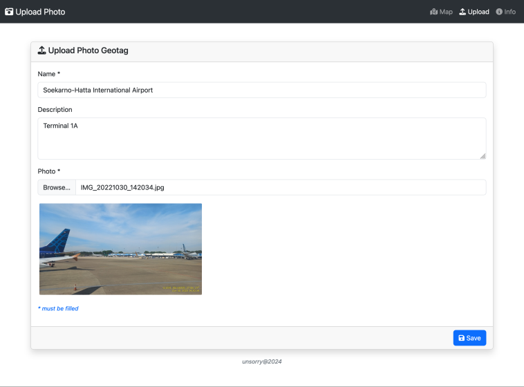
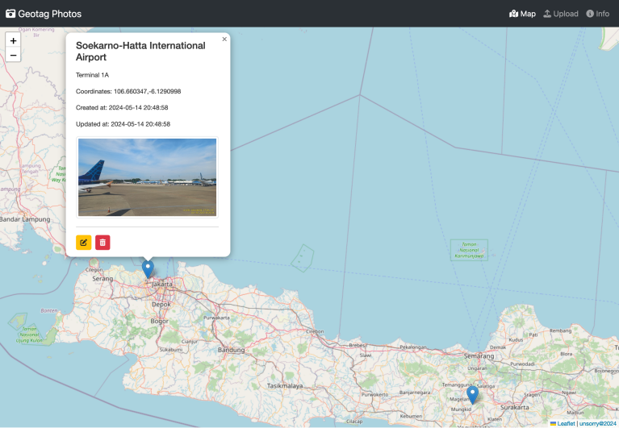
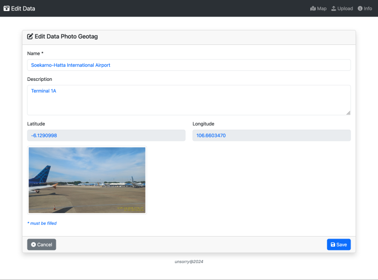

<h2 align="center">CRUD Geotag Photos</h2>

## About

This application is a simple CRUD application that allows users to upload geotagged photos and get location coordinates from them. This application uses LeafletJS to display photo locations on a map. Developed using laravel 11.x.

## Features

- Display location coordinates on a map
- Upload geotagged photo
- Update data geotagged photo
- Delete location coordinates and photo

## Requirements

- PHP 8.2 or higher
- PHP Extensions: Ctype, cURL, DOM, Fileinfo, Filter, Hash, Mbstring, OpenSSL, PCRE, PDO, Session, Tokenizer, XML, Exif
- Composer
- Node.js
- NPM
- Database (MySQL, PostgreSQL, SQLite, SQL Server, etc.)

[https://laravel.com/docs/11.x/deployment#server-requirements](https://laravel.com/docs/11.x/deployment#server-requirements)

## Installation

#### Manual Installation

- Clone the repository
- Create a new database
- Copy the `.env.example` file to `.env`
- Update the `.env` file with your database credentials
- Run `composer install`
- Run `npm install`
- Run `npm run build`
- Run `php artisan key:generate`
- Run `php artisan migrate`
- Run `php artisan storage:link`
- Run `php artisan serve`
- Visit `http://localhost:8000` in your browser

#### Makefile Installation
- Clone the repository
- Run `make setup`
- Run `make dev`
- Visit `http://localhost:8000` in your browser

## Preview

___
> unsorry@2024
